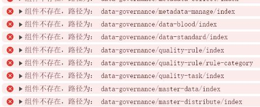

# ant-ai

## 注意
由于在开发阶段，频繁提交，可能会有提交遗漏代码或是数据库脚本未及时同步的情况。如遇到请添加微信入群交流或提交Issues。功能会陆续完成开放。

## 介绍
AIOT人工智能物联网平台是一站式物联网开发基础平台，帮助企业快速实现数字化、精细化数据管理。核心系统为：物联网平台 + 数据中台（数据底座）+ AI。
欢迎大家添加最下方的微信入群交流。

  系统包含了缺陷检测、烟火检测、安全帽检测、车流检测、车辆检测、入侵检测、车牌检测、花检测、动物检测、口罩检测、人流检测等等AI模型。并且支持训练、标注等功能。

## 软件架构说明
  本系统采用springboot、spring cloud、vertx、redis、H2、mysql、elasticsearch、TDEngine、RocketMq、flink、hadoop、kafka、Vue3、Mybatis-Plus、minio、k8s等框架和第三方软件，中间件采用模块化无侵入集成非常容易扩展和替换。

## 系统部分截图

  AI功能

## 微信群(添加我微信备注"进群"):

## FAQ:
1、目前摄像头部分为调用本地摄像头，仅供参考，后期会修改为调用rtmp、rtsp实时视频。目前前端暂未处理。后台可供参考

2、前端组件不存在错误提示，不用担心，登录系统后在系统菜单中删除这些菜单即可，不影响系统

## 鸣谢声明

该项目使用借鉴了以下优秀开源项目的源码进行改造集成，特此鸣谢声明。

**数据平台**

[数睿通数据中台](https://gitee.com/zrxjava/srt-data-center)

**物联网**

[铱塔智联](https://gitee.com/open-iita/iotkit-parent)

**车牌检测**

[车牌检测](https://github.com/we0091234/Chinese_license_plate_detection_recognition)

